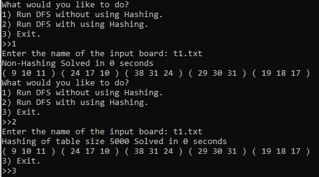
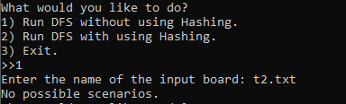

# Author
Nick Flouty

# Objective
Solves the board game Peg solitaire, using either a hash table or with no table.

# Output

Also reports if the starting peg solitaire board is of an already finished game.

